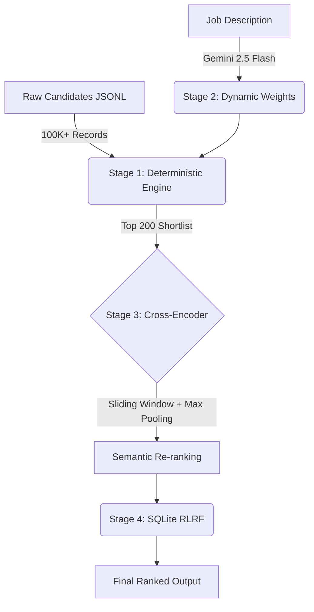

# Aethelgard 🏆


**Built for the Hack2Skill Data & AI Challenge**

## 🚀 Problem Statement
The collapse of traditional ATS keyword-matching has led to the rise of AI-driven "resume inflation" and honeypot profiles. Recruiters are overwhelmed by candidates who keyword-stuff modern AI/ML terms without the actual trajectory or experience to back it up. 

## 💡 Why This Matters
Finding the true signal in massive datasets (100,000+ candidates) requires a system that can bypass superficial keywords. Aethelgard enables recruiters to screen at scale without false positives, optimizing for actual engineering capability and alignment.

## ✨ Features
- **Honeypot Detection:** Active penalization of profiles with non-technical job titles that keyword-stuff AI/ML buzzwords.
- **Explainable AI Cards:** Expandable candidate cards displaying exact strengths, concerns, and a visual score breakdown.
- **RLRF Feedback Loops:** Persistent Reinforcement Learning from Recruiter Feedback.
- **System Profiler Cockpit:** Live dashboard tracking Candidates/Sec, Memory Usage, and NDCG@10 alignment.

## 🏗 AI & System Architecture
Aethelgard operates on an optimized **4-Stage Hybrid Pipeline**:



1. **Deterministic Streaming:** An O(N) `heapq` architecture processing 100K+ records safely across 7 core dimensions.
2. **Dynamic LLM Weights:** Gemini 2.5 Flash dynamically weights the 7 dimensions based on the input Job Description using strict Pydantic schemas.
3. **Sliding-Window Cross-Encoder:** A deep semantic alignment layer applied to the top 200 candidates. Overcomes the 512-token limit by max-pooling overlapping 350-token windows.
4. **Persistent SQLite RLRF:** Recruiter feedback (👍/👎) instantly commits to a local SQLite database, permanently adjusting future candidate scores.

## 🔄 Workflow & Folder Structure

```text
📁 aethelgard/
├── 📄 app.py              # Streamlit SaaS Interface & Cockpit
├── 📄 rank.py             # Deterministic O(N) Engine + Semantic Pipeline
├── 📄 ai_core.py          # LLM Weight Configuration via Gemini
├── 📄 database.py         # SQLite Persistence & RLRF
├── 📄 requirements.txt    # Dependency Manifest
├── 📄 test_scoring.py     # Smoke Tests & Validation
├── 📄 release.sh          # CI/CD Deployment Script
└── 📁 docs/               # Advanced Architecture & Setup Docs
```

## 🛠 Technology Stack
- **Core Engine:** Python 3.9+, standard library (`heapq`, `sqlite3`).
- **UI:** Streamlit, Pandas.
- **AI/ML:** sentence-transformers (`cross-encoder/ms-marco-MiniLM-L-6-v2`), PyTorch.
- **Generative AI:** `google-genai` (Gemini 2.5 Flash).
- **Profiling:** `psutil`.

## 📦 Installation & Configuration
```bash
git clone https://github.com/aethelgard/aethelgard.git
cd aethelgard
python -m venv venv
source venv/bin/activate  # On Windows: venv\Scripts\activate
pip install -r requirements.txt
export GOOGLE_API_KEY="your-gemini-api-key"
```

## ▶️ Running Locally & Deployment
```bash
streamlit run app.py
```
*Note: Aethelgard requires no external databases. SQLite is automatically initialized locally.*

## 📚 API Documentation & Architecture
Please refer to [docs/API_REFERENCE.md](docs/API_REFERENCE.md) and [docs/ARCHITECTURE.md](docs/ARCHITECTURE.md).

## 🔮 Future Scope
- Integration with external ATS systems (Workday, Greenhouse).
- Multi-modal JD processing (e.g., matching candidates to recorded hiring manager calls).
- Distributed processing for datasets > 10M records.

## 👥 Team Members
- **Sneha Paul**
- **Tejasv Sharma**

## 📜 License & Acknowledgements
MIT License. Built for the Hack2Skill Data & AI Challenge.
