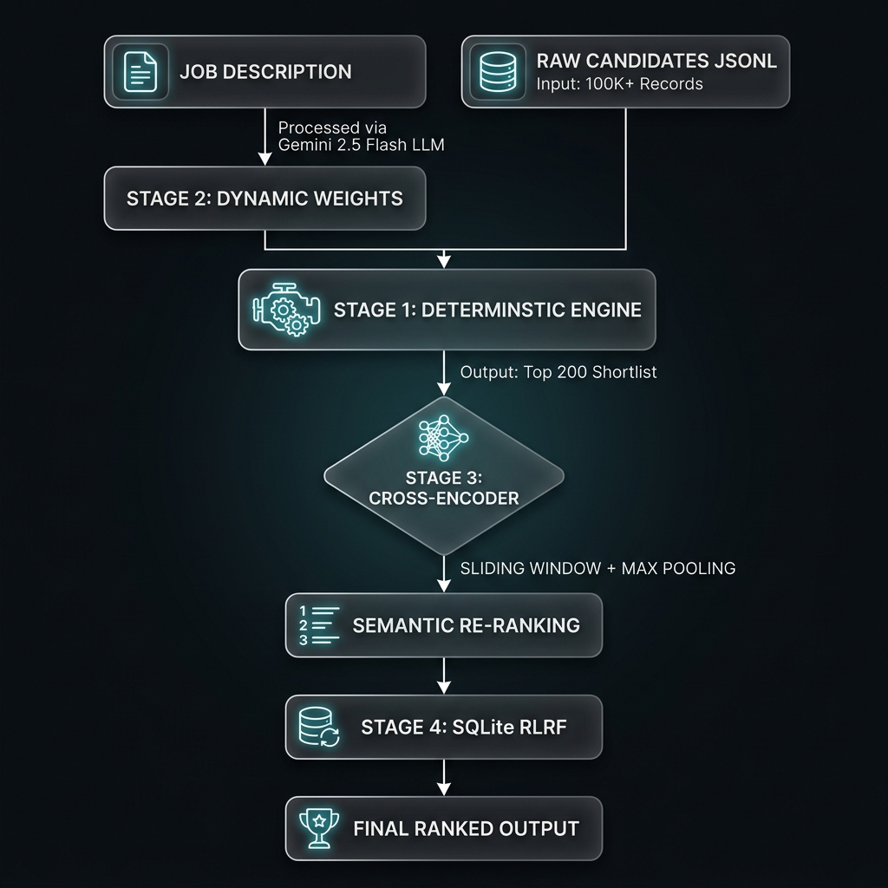
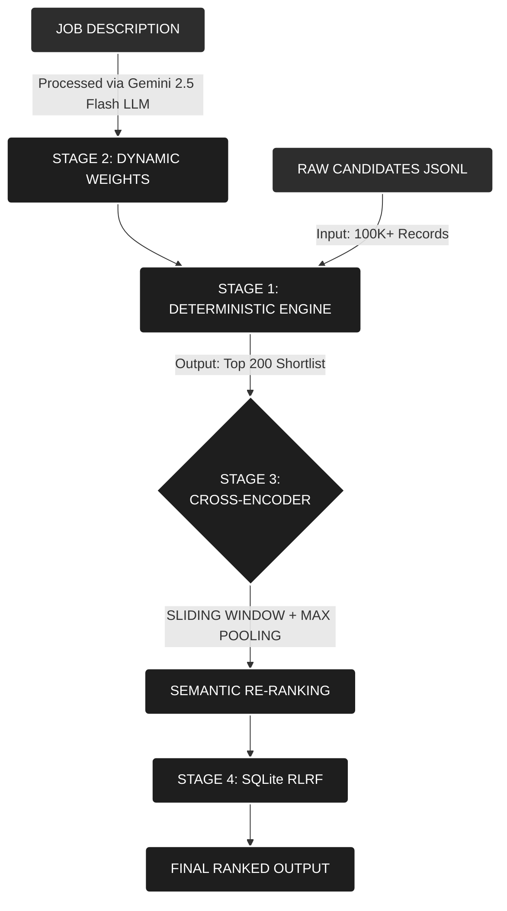

# Architecture Deep Dive

## AI & System Architecture
Aethelgard operates on an optimized **4-Stage Hybrid Pipeline**:

1. **Stage 2: Dynamic Weights:** Gemini 2.5 Flash processes the Job Description first to generate strict Pydantic schemas. These dynamic weights are then merged into Stage 1.
2. **Stage 1: Deterministic Engine:** The O(N) `heapq` architecture streams 100K+ records safely, scoring candidates and outputting the "Top 200 Shortlist".
3. **Stage 3: Cross-Encoder:** The deep semantic alignment layer applied to the Top 200 Shortlist. It relies on "Sliding Window + Max Pooling" before moving to Semantic Re-ranking to overcome the 512-token limit.
4. **Stage 4: SQLite RLRF:** The final processing gate. Persistent Reinforcement Learning from Recruiter Feedback (👍/👎) commits to a local SQLite database, applying adjustments before outputting the Final Ranked Output.

---

## 1. The Core Throughput Anchor (Deterministic Streaming)
The application utilizes an asynchronous `heapq` streaming queue. It passes 100,000+ candidate JSONL records down to an actionable cohort (top 200) based on dynamic parameters. Memory is bounded to O(k), where k is the top cohort size.

## 2. Sliding Window Cross-Encoder (Cognitive Max-Pooling)
The downstream semantic re-ranking pipeline uses `cross-encoder/ms-marco-MiniLM-L-6-v2`. To overcome its strict 512-token context window, Aethelgard segments dense professional histories into overlapping 350-token windows (step=100). Each window is scored, and a max-pooling strategy `Score = max(s_1, ..., s_n)` is applied to capture deep technical experience.

## 3. Persistent Compliance & RLRF
Recruiter adjustments (👍/👎) are committed to a local SQLite architecture with fully indexed relational schemas (`recruiter_feedback`, `job_profiles`, `compliance_audit`), bypassing Streamlit's volatile session state.

## 4. Structural Schema Enforcement
The dynamic meta-prompt weight configuration engine uses `google.genai types.GenerateContentConfig` to guarantee that JSON payload responses strictly map to the 7-axis integers. Defensive fallbacks prevent crashes during network limits.
